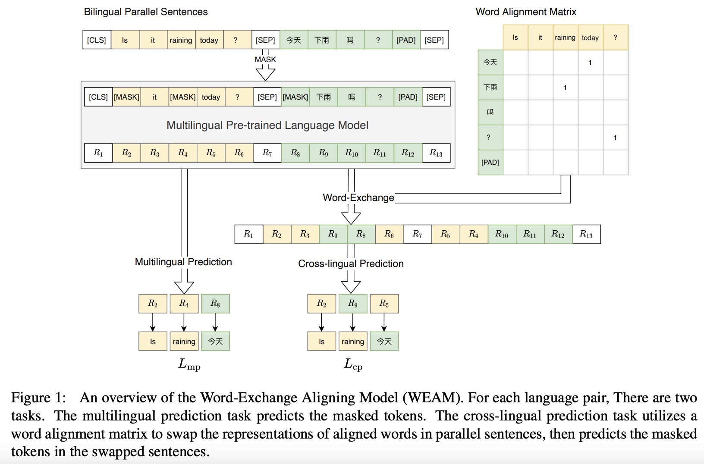
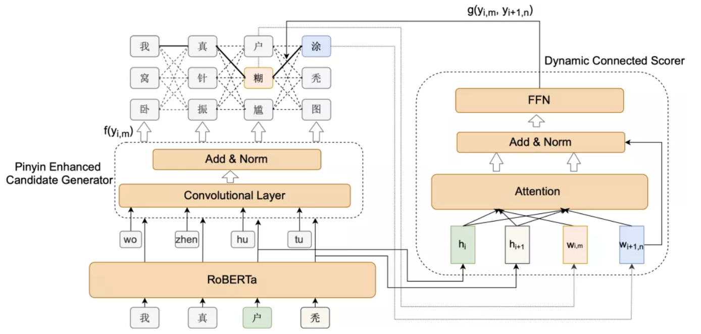
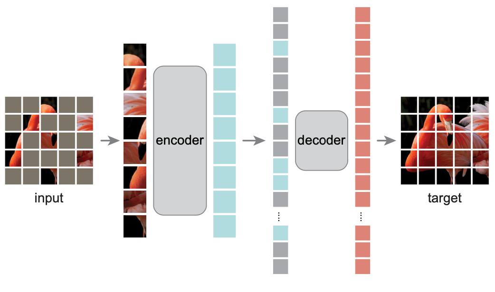
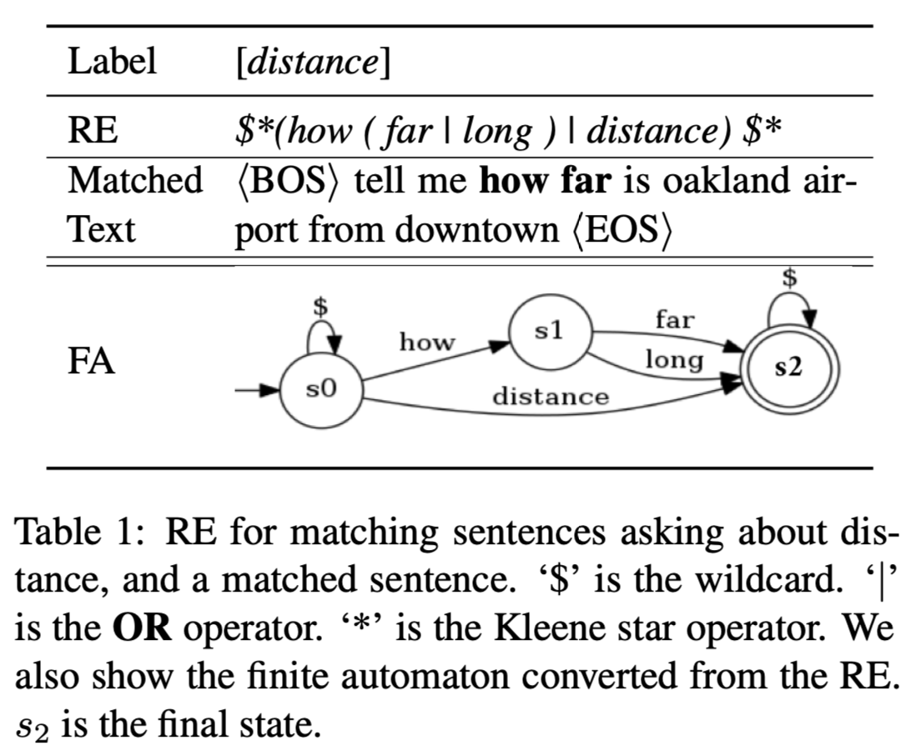
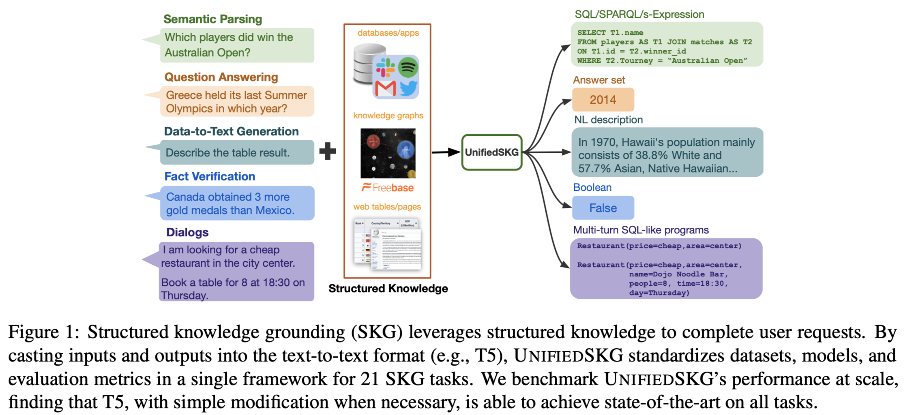
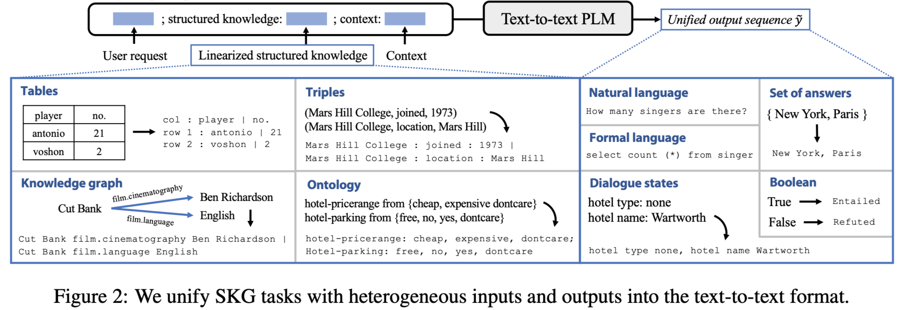
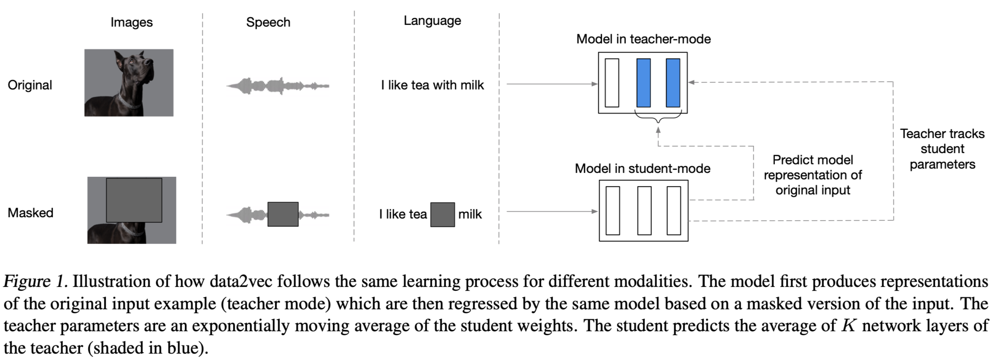

[TOC]

## Bilingual Alignment Pre-Training for Zero-Shot Cross-Lingual Transfer (MRQA 2021)
* 论文地址：https://arxiv.org/abs/2106.01732
* 主要内容：多语言预训练模型在跨语言任务上取得了惊人的效果。在这类任务中，模型利用源语言的训练集训练，在目标语言的测试集上测试。在预训练阶段即便不借助平行语料，而仅通过MLM自监督训练，模型也可习得跨语言zero-shot能力。而如果使用双语平行语料，跨语言zero-shot效果能得到进一步的提升。本次分享将先回顾现有的双语平行语料预训练对齐技术，然后介绍我们提出的双语对齐预训练模型 Word- Exchange Aligning Model (WEAM)：**使用统计对齐信息作为先验知识，训练模型使用一种语言的上下文表示预测另一种语言中的token**。实验表明，WEAM不仅在下游任务上提升了跨语言迁移性能，从多语言词向量相似度的角度看其词向量表示也优于baseline。

* 多语言预训练模型
模型结构相同，训练数据多个语言语料
  * 特点
    * **跨语言能力**
    * 减少开发维护
  * setting
    * supervised：与单语言类似
    * **zero-shot**：在一种语言上训练，在其他语言上测试
    * few-shot
  * mbert
    跨语言能力研究结论：1）每层有区分语言的能力；2）更容易泛化到相似语法的语言

* 双语预训练模型
  * XLM’： +TLM（平行句对，随机mask任一词）
  * infoXLM： +TLM +XLCo（平行句子表示拉近，非平行句子表示拉远）
  * ERNIE-M： +TLM +CAMLM +BTMLM

* 多语言预训练模型中的对齐
  * 拉近翻译词对的表示（相似度）+ 与为对齐模型做正则化（防止学成同一个词的表示）
  * 隐式vs显式
  * 动态（hidden）vs静态（embedding）
  * 预训练vs微调

* Bilingual Alignment Pre-Training for Zero-Shot Cross-Lingual Transfer (MRQA 2021)
**WEAM**

## 中文拼写纠错最新进展

### 任务
* 错字：字形
* 别字：字音字形字义

### 研究切入点
* 模型
  * 编码：pretrain阶段引入额外信息、模型结构
  * 解码：混淆集
* 数据：高质量伪数据

### 生成对抗样本

### 半监督课程学习

由易到难，选择困难样本加入训练

### global attention decoder （GAD）

解决相邻字错误导致中间的错误改不了 - GAD（候选做attention）

### spellbert

### Dynamic Connected Networks for Chinese Spelling Check

目前关于中文拼写纠错任务的最新研究都是采用基于BERT的非自回归模型。非自回归模型的输出独立假设使BERT模型不能很好地学到输出汉字之间的依赖关系，产生输出语句不连贯的问题。为了解决上述问题，我们提出了一个全新的动态连接网络（DCN），先通过拼音候选生成器产生合适的候选，再通过基于Attention机制的网络对两个相邻汉字的依赖关系进行建模。

## Masked Autoencoders Are Scalable Vision Learners [by何恺明]

* motivation

AE用在nlp效果不好：
1）cnn对mask token和position embedding的处理不好
2）mask用在图像上，可以较容易从周围点推理出来

* method

encoder：（有position embedding）随机打乱（无序）mask大量（eg.后75%）,对没有mask的部分编码。

decoder：还原回去

损失：重构损失mse

* thoughts

用在图像领域效率还是存在问题的吧

## 句子表示学习

### mirro-bert

通过对比学习增强bert的词句子表示能力

对比学习构造正例方法：
1. token（增、删、打乱。。。）
2. 特征（mask、dropout、噪声。。。）

计算相似度时，能区分开

### trans-encoder

bi-encoder 和 cross-encoder互相蒸馏

蒸馏中还增加了ensemble

### confitional MLM

把上下句的句子表示引入当前句子 怎么加的？

### TSDAE

encoder、decoder之间不做attention
感觉就是简化版transformer+恢复任务。但是实验效果比其他baseline好很多。amazing

## 报告主题： Curriculum Learning for Natural Language Understanding
论文地址：https://aclanthology.org/2020.acl-main.542.pdf
主要内容：
课程学习（Curriculum Learning）方法通过从简单样例到困难样例的过程来学习模型，进而使模型有更好的性能表现。常见的课程学习方法采用启发式方法衡量样本难度，对不同的任务需要制定不同的衡量方法。本文提出一种通用的针对NLU任务的课程学习方法，采用类似于交叉验证的方法去衡量每个样例的难度，该方法在多个NLU任务上取得了很好的效果。迎其他研究组感兴趣的同事参加！

* 课程学习

从简单到难（重点在于判断难易程度并划分数据集）
在训练初期花更少的时间在噪声和困难数据上

* 常用方法

1. self-paced 学生自己当老师。模型loss作为评判容易困难程度
2. transfer teacher
3. rl动态选择数据

## 正则表达式->神经网络【适合冷启动】

将正则表达式直接转化成一个对应的神经网络，使得该神经网络不需要训练就有着和正则表达式系统相似的效果，同时，还可以通过标注数据进行训练以达到更好的性能。

### （EMNLP 2020）Cold-Start and Interpretability：Turning Regular Expressions into Trainable Recurrent Neural Networks [[code](https://github.com/jeffchy/RE2RNN)]

将用作意图分类的正则表达式转化为可以训练的神经网络

> [相关解读](https://mp.weixin.qq.com/s/NCxKJELBGHvuIvi5j_xMKA)

* motivation

提出FA-RNNs，把正则表达式转换成rnn，这样可以获得和正则表达式等效的效果，并且这个网络是可以拥有标签数据训练的，训练后还会有进一步提升，值得一提的是，训练完竟然还能转换回正则表达式

适合zero-shoot和缺乏数据时做冷启动。在低资源数据上分类效果优于nn

* method

### （EMNLP 2021）Neuralizing Regular Expressions for Slot Filling

将用于语义槽填充的正则表达式转化为可以训练的神经网络的方法。

> [相关解读](https://mp.weixin.qq.com/s/wblvSMSpxPJ4ouk49LbxAw)

# 利用深层语言分析提升作文自动评分

* 浅层特征：字词段等统计特征
* 深层特征：语病、流畅、结构严谨等

iflyEA：语言运用、语言表达、篇章异常检测、篇章质量

语法纠错：reselectra识别、bart纠错+masked soft bert字

大数据训练通用模型->少量数据自适应迁移得到专用模型

## 语文评阅落地

市场环境分析（政策导向、市场空间BGC、竞品）

排序评分：视角转换，小规模->大规模数据

针对问题进行模型改进

篇章没有位置信息的问题，引入段落相对位置+段落内位置+全局位置的embedding

润色：生成式风险高，机翻式不连贯。转换成推荐润色

# UNIFIEDSKG: Unifying and Multi-Tasking Structured Knowledge Grounding with Text-to-Text Language Models (18家机构联合发表)[[paper](https://arxiv.org/pdf/2201.05966.pdf)][[code](https://github.com/hkunlp/unifiedskg)]

* 目标： 提升SKG（结构化的数据作为输入）任务的效果，刷榜：）

* 方法：把结构化的数据统一用非结构化的文本表示，然后用t5微调

T5精调+多任务prefix-tunning

# data2vec: A General Framework for Self-supervised Learning in Speech, Vision and Language (arxiv 2022 meta)[[code](www.github.com/pytorch/fairseq/tree/master/examples/data2vec)]

* motivation：to propose a general framework for 3 modality， speech、nlp、cv.

* method: to predict latent representations instead of single word or cv token

用masked input的representation预测unmasked input的representation

* conclusion：在三类分类任务上微调后，语音和cv超出其他baseline较明显，文本上略有提升
