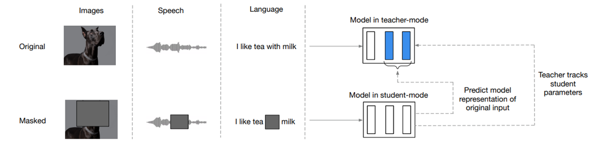
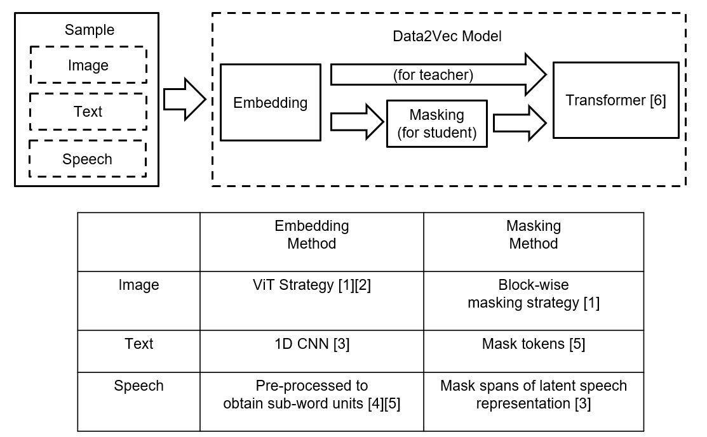
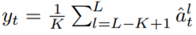
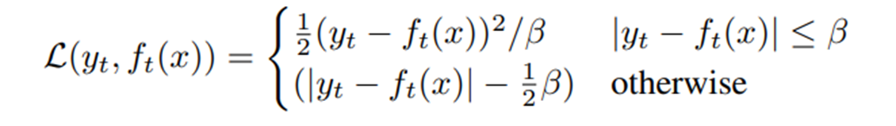
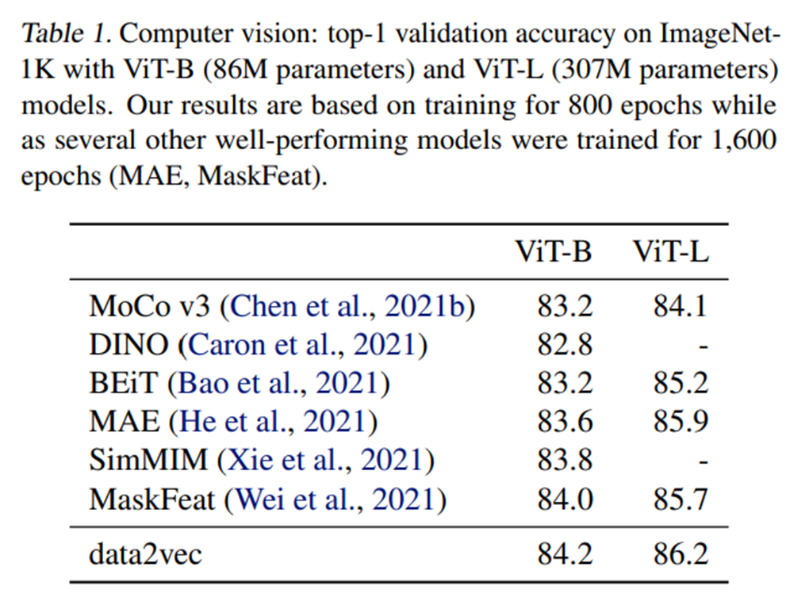
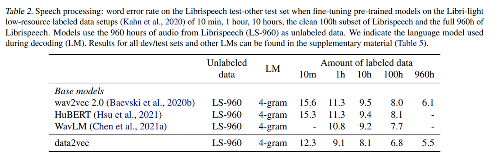
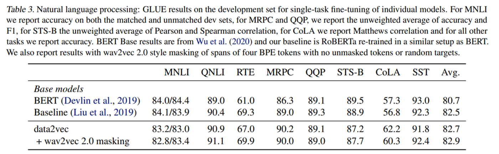
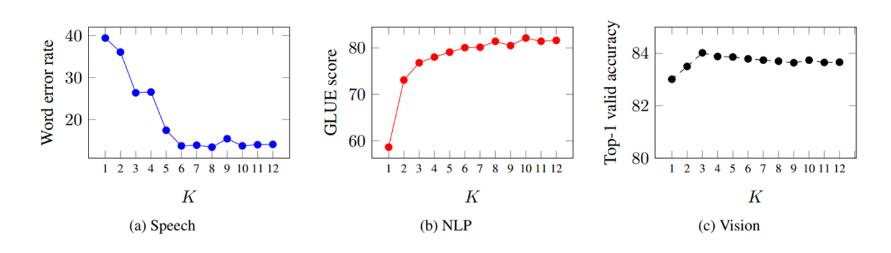
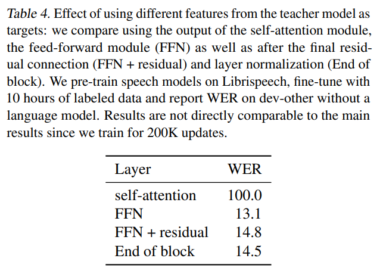

<!--
 * @Author: Catherine Xiong
 * @Date: 2022-01-26 21:11:14
 * @LastEditTime: 2022-01-27 21:41:34
 * @LastEditors: Catherine Xiong
 * @Description: 
-->

<!-- _class: lead -->

# data2vec: A General Framework for Self-supervised Learning in Speech, Vision and Language （META）

---

# Motivation

* There are currently big differences in the way self-supervised learning algorithms learn from images, speech, text, and other modalities.

    **data2vec**, the first high-performance self-supervised algorithm that works for multiple modalities :white_check_mark:

---

# Method Overview
The teacher mode generates representation from a given sample (i.e. image, speech, text). A masked version of the same sample is passed to the student mode. Learning happens by minimizing the objective function between the student’s prediction of a target that is constructed by teachers’ parameters.

---
# Method

---

---

* The target is then constructed by using the top K (closer to the output) blocks of the transformer.

* Objective Function

---
# Results

---

**1. Image (metric: accuracy. Higher value, better performance):**

---
**2. Speech (metric: word error rate. Lower value, better performance)**

---
**3. Texts (metric: GLUE score. Higher value, better performance)**

---
# Ablation Study
---
**1. Top K blocks**
The paper argues that using the average of top K blocks in the teacher mode is better than using just the top one

---
**2. Target Feature Type**
Rather than just use the top K blocks, the authors also tried using different parts of the teacher mode and found that using the FFN is the best.

---

## Conclusion

* The paper introduces a new general self-supervised learning framework and achieves SOTA performance for three modalities.

## Personal Remarks:
* It’d be more interesting to see how this method performs for unstructured modality, e.g. graphs 
* Transformer, as a flexible architecture not constraint to a specific modality, plays an important role in the success of this method.
* This work serves as a key step for unifying inputs from different modalities. 